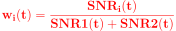

# Dual-Band FMCW Radar Fusion Algorithms (MATLAB Implementation)

This repository contains MATLAB implementations of **dual-band radar fusion algorithms** developed for a low-cost FMCW radar system.  
The fusion is performed **at the signal level** (after dechirping, before FFT), enabling improved target detection under low-SNR conditions.

<p align="center">
  
</p>

## 📌 Implemented Fusion Algorithms
- **GEF:** Gain Envelope Fusion  
- **AEF:** Adaptive Envelope Fusion  
- **GPF:** Gain Power Fusion  
- **APF:** Adaptive Power Fusion  

---

## 📚 Theoretical Background

### 🔹 Fusion Stage
The fusion is applied on the **beat signals** `s1(t)` and `s2(t)` from the 5.8 GHz and 24 GHz radars,  
after bandpass filtering and envelope/power extraction.

---

### 🔹 Envelope Fusion (GEF)
<p align="center">
  
</p>

<p align="left"><i>where w1 and w2 are fixed fusion weights.</i></p>

---

### 🔹 Adaptive Envelope Fusion (AEF)
<p align="center">
  
</p>

<p align="center">
  
</p>

<p align="left"><i>where Q_i(t) is the segment energy of radar i.</i></p>

---

### 🔹 Power Fusion (GPF)
<p align="center">
  
</p>

---

### 🔹 Adaptive Power Fusion (APF)
<p align="center">
  
</p>

<p align="center">
  
</p>

<p align="left"><i>where SNR_i(t) is the instantaneous signal-to-noise ratio of radar i.</i></p>

---

## 📂 Repository Structure
```
📂 DualBand_Fusion
┣ 📜 GEF.m # Gain Envelope Fusion
┣ 📜 AEF.m # Adaptive Envelope Fusion
┣ 📜 GPF.m # Gain Power Fusion
┣ 📜 APF.m # Adaptive Power Fusion
┣ 📜 beat_5_8GHz.mat # Example beat signal (5.8 GHz)
┣ 📜 beat_24GHz.mat # Example beat signal (24 GHz)
┗ 📜 README.md # Project documentation
```

---

## 🚀 How to Use

### Requirements
- MATLAB R2021 or later
- Signal Processing Toolbox

### Steps
1. Clone this repository:
   ```bash
   git clone https://github.com/yourusername/DualBandRadarFusion.git
   ```
The script will:

Perform filtering, Hilbert transform, and fusion

Apply FFT on the fused signal

Estimate beat frequency 
𝑓
𝑏
f 
b
​
  and range 
𝑅
R

Display plots of signals and FFT spectrum

📊 Example Output
FFT of Fused Signal

Segment-wise Adaptive Weights (for AEF/APF)

Estimated Range Values

📝 Citation
If you use this code in your research, please cite:

📄 License
MIT License – Free to use with attribution.
---

